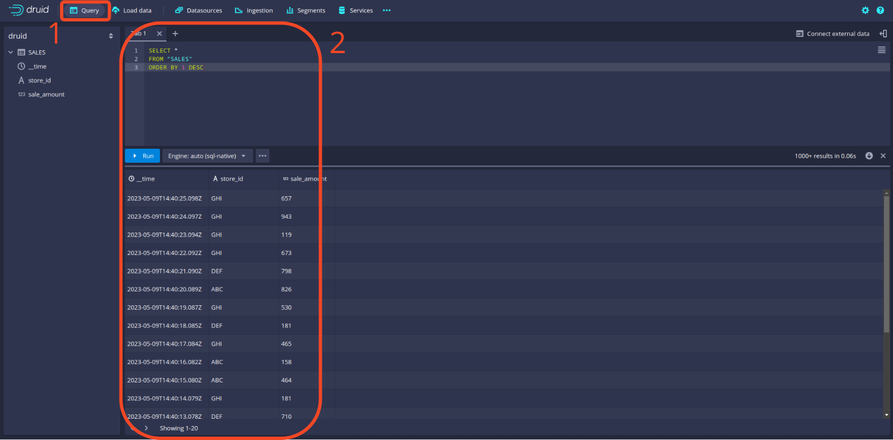

## :bulb: Introduction

In this new blog post (or github repo), we build on everything we have seen so far in this Kafka 101 Tutorial series, namely:

1. [Kafka Infrastructure](https://github.com/theodorecurtil/kafka_101)
2. [Kafka Producer](https://github.com/theodorecurtil/kafka_sales_producer)
3. [Flink Infrastructure](https://github.com/theodorecurtil/flink_sql_job)

and we will see how to ingest our streaming data into a real-time database: [Apache Druid](https://druid.apache.org/)! In addition, we will see how to visualize the data that we produce (either from our raw stream of events or our Flink-aggregated stream) using real-time dashboards supported by [Apache Superset](https://superset.apache.org/). Notice that we are using only [Apache](https://www.apache.org/) technologies so far; that is because we root for the open-source community :hugs:.

The two new services we introduce in this article are a bit less known than what we have used so far, so I am just going to introduce them briefly.

### :mage_man: Apache Druid

> [Druid is a high performance, real-time analytics database that delivers sub-second queries on streaming and batch data at scale and under load.](https://druid.apache.org/)

- Druid is a column-oriented data store, which means that it stores data by column rather than by row. This allows for efficient compression and faster query performance.
- Druid is optimized for OLAP (Online Analytical Processing) queries, which means it's designed to handle complex queries on large data sets with low-latency response times.
- Druid supports both batch and real-time data ingestion, which means that it can handle both historical and streaming data.
- Druid includes a SQL-like query language called Druid Query Language (DSL), which allows users to write complex queries against their data.
- Druid integrates with a number of other data processing and analysis tools, including Apache Kafka, Apache Spark, and Apache Superset.

### :infinity: Apache Superset

Apache Superset is a modern, open-source business intelligence (BI) platform that allows users to visualize and explore their data in real time.

> [Superset is fast, lightweight, intuitive, and loaded with options that make it easy for users of all skill sets to explore and visualize their data, from simple line charts to highly detailed geospatial charts.](https://superset.apache.org/)

- Superset was originally developed by Airbnb, and was later open-sourced and donated to the Apache Software Foundation.
- Superset is designed to connect to a wide variety of data sources, including databases, data warehouses, and big data platforms.
- Superset includes a web-based GUI that allows users to create charts, dashboards, and data visualizations using a drag-and-drop interface.
- Superset includes a wide variety of visualization options, including bar charts, line charts, scatterplots, heatmaps, and geographic maps.
- Superset includes a number of built-in features for data exploration and analysis, including SQL editors, data profiling tools, and interactive pivot tables.

## :whale2: Requirements

To get this project running, you will just need minimal requirements: having [Docker](https://www.docker.com/) and [Docker Compose](https://docs.docker.com/compose/) installed on your computer.

The versions I used to build the project are

```bash
## Docker
docker --version
> Docker version 23.0.6, build ef23cbc431

## Docker Compose
docker-compose --version
> Docker Compose version 2.17.3
```

If your versions are different, it should not be a big problem. Though, some of the following might raise warnings or errors that you should debug on your own.

## :factory: Infrastructure

To have everything up and running, you will need to have the whole producer part running ([the repo from the previous article](https://github.com/theodorecurtil/flink_sql_job)) and Druid and Superset. To do this, do the following:

```bash
## Clone the repo
git clone https://github.com/theodorecurtil/flink_sql_job.git

## cd into the repo
cd flink_sql_job

## docker-compose the infra
docker-compose up -d

## go back to previous level
cd ..

## Clone the new repo
git clone git@github.com:theodorecurtil/real_time_dashboarding.git

## cd into the repo
cd real_time_dashboarding

## start the infrastructure
./start.sh
```

> :warning: You might have to make the `start.sh` script executable before being allowed to execute it. If this happens, simply type the following command

```bash
chmod +x start.sh
```

The Druid [docker-compose](https://github.com/theodorecurtil/real_time_dashboarding/blob/main/druid_setup/docker-compose.yaml) file assumes that the Kafka cluster is running on the Docker network `flink_sql_job_default`. It should be the case if you cloned the `flink_sql_job` repo and started the infra using the commands listed before. Otherwise, simply adjust the references to the `flink_sql_job_default` Docker network in the `docker-compose` file.

### Sanity Check

To check that all the services are up and running (you will see that a lot of Docker containers are running by now), visit the following urls and check that all the UIs load properly:

1. Kafka: [http://localhost:9021](http://localhost:9021/clusters)
2. Flink: [http://localhost:18081](http://localhost:18081/#/overview)
3. Druid: username is `druid_system` and password is `password2` [http://localhost:8888](http://localhost:8888)
4. Superset: username is `admin` and password is `admin` [http://localhost:8088](http://localhost:8088)

You should see something like


## :cyclone: Druid Stream Ingestion

The Kafka producer we started produces messages in the `SALES` topic. These are fake sales events produced every second with the following schema

```json
{
    "type": "record",
    "name": "StoreSale",
    "namespace": "com.acosom",
    "fields": [
        {
            "name": "store_id",
            "type": {
                "type": "string",
                "avro.java.string": "String"
            },
            "doc": "ID of the store where the sale was made."
        },
        {
            "name": "sale_amount",
            "type": "int",
            "doc": "Amount of the sale in local currency. This value is an integer."
        },
        {
            "name": "sale_ts",
            "type": "long",
            "doc": "Epoch timestamp when the sale happened."
        }
    ]
}
```

First thing we will do is connect Druid to our Kafka cluster to allow the streaming ingestion of this topic and store it in our real-time database.

We will do this using Druid's UI at [http://localhost:8888](http://localhost:8888). Below we show how to create the streaming ingestion spec step by step, but note that the ingestion spec can simply be posted using Druid's rest API as a json.

The first step is to click the `load data` button and select the `Streaming` option.


Then select `Start a new streaming spec` to start writing our custom streaming spec.


Once this is done, select `Apache Kafka` as the source.


Once this is done, write the address of the Kafka broker and the topic name and click to apply the configuration. You should then see on the left sample data points from our `SALES` topic. Note that the data is not deserialized as this is the raw data coming from Kafka. We will need to include the Avro deserializer. To do this, click the `Edit spec` button.


In the spec config, add the following (thank you [Hellmar](https://blog.hellmar-becker.de/2021/10/19/reading-avro-streams-from-confluent-cloud-into-druid/)):

```json
"inputFormat": {
"type": "avro_stream",
"binaryAsString": false,
"avroBytesDecoder": {
    "type": "schema_registry",
    "url": "http://schema-registry:8081"
    }
}
```

and then click the `Parse data` button to go back to editing the spec.


Now you should see our data being properly deserialized! Click the `Parse time` button to continue.


From now on, there is not much more to edit, simply click through the panels until the streaming spec is submitted. Druid's UI will then automatically redirect to the `Ingestion` tab where you should see the following, indicating that Druid is successfully consuming from Kafka.


Finally, to check that data is properly loaded in Druid, click the `Query` tab and try a mock query. See example below.



## Data Visualization in Superset

Now that the data in successfully being ingested in our streaming database, it is time to create our dashboard to report sales to management!

Navigate to the Superset UI at [localhost:8088](http://localhost:8088).

First thing we need to do is to connect our Druid database to Superset. To do this, click the `+` button in the upper-right corner and select `Data` and `Connect database`. Then, follow the steps shown below. Note that the connection string contains the following:

1. database type: `druid`
2. database credentials: `druid_system` and `password2`
3. database sql endpoint: `172.18.0.1:8888/druid/v2/sql`

Because Superset is not running on the same Docker network as the other services, we have to access it using the host. This will change depending on your OS. See [Superset documentation](https://superset.apache.org/docs/installation/installing-superset-using-docker-compose/#5-connecting-superset-to-your-local-database-instance).

Basically, the following should apply:

1. `host.docker.internal` for Mac or Ubuntu users
2. `172.18.0.1` for Linux users


### Create Dashboard

In Superset, a `Dashboard` in made of `Charts`; so the first thing is to create a `Chart`. To create a `Chart` we need to create a `Dataset` object. Click the `Dataset` button and follow the steps below to create a `Dataset` from the `SALES` topic.


Create a time-series area chart from the `SALES` dataset and add a couple of configurations to the chart, as shown below. Then save the `Chart` and add it to a new `Dashboard`!


## :chipmunk: Throw in some Apache Flink

You will note that the Superset `Chart` that we created does the 1-Minute aggregation that our Flink job also does. Let us directly consume the aggregated data from Apache Flink.

The steps to follow:

1. Start the Flink job
2. Write the streaming ingestion spec into Druid from the new topic
3. Create new chart in Superset and add it to the dashboard

### Start the Flink job

To start the aggregating Flink job, that computes aggregated sales per store per bucket of 1 minute, type the following commands:

```bash
## Docker exec in the container
docker exec -it sql-client bash

## Start the Flink job
sql-client.sh -f sales-aggregate.sql

## Exit container
exit
```

You will see in Kafka that a new topic `SALES_AGGREGATE` is created by the Flink job.

Now repeat the operations related to Druid and Superset to ingest the data in Druid and create the `Chart` in Superset.

See the dashboard below


As expected, the two charts are identical, as the same aggregation is performed; but in one case the aggregation in performed in Superset, and in the other case it is performed via Apache Flink, and Superset simply reads the data from the database without having to perform any work. In addition we created a pie-chart that shows the share of each store in the total amount of sales. As expected, this is close to a uniform distribution of the sales as each store generates sales from the same uniform distribution.